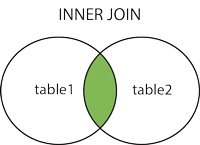

# SQL

## What is a Database?

A database is an organized collection of data., Database can be stored in different ways.

## Database Management System(DBMS)

A special software program that helps users create and maintain a database

- Makes it easy to manage large amount of information
- Handles security
- Backups
- Importing/Exporting Data
- Concurrency
- Interacts with software applications

## Database Types

**Relational Databases (SQL)**

- Organize data into one or more tables
    - Each Table has columns and rows
    - A unique key identifies each row
- **Relational Database Management Systems(RBDMS)**
    - Helps users create and maintain a relational Database
    - mySQL, Oracle, PostgreSQL, mariaDB

**Non-Relational Databases (NoSQL)**

- Organize data is anything but a traditional table
    - Key-Value stores
    - Documents(Json, xml, etc)
    - Graphs
    - Flexible tables
- **Non-Relational Database Management Systems(NRBDMS)**
    - Helps users create and maintain a non-relational Database
    - MongoDB, DynamoDB, Apache Cassandra, firebase, etc..

## What is SQL?

**SQL (Structured Query Language)** is a programming language designed for managing data in a **relational database**. 

**SQL** perform C.R.U.D operations, as well as other administrative tasks(user management, security, backup, etc..)

**SQL** has a variety of functions that allow its users to read, manipulate, and change data. 

**SQL** popular with data analysts for a few reasons:

- It's semantically easy to understand and learn.
- Because it can be used to access large amounts of data directly where it's stored, analysts don't have to copy data into other applications.
- Compared to spreadsheet tools, data analysis done in SQL is easy to audit and replicate. For analysts, this means no more looking for the cell with the typo in the formula.

**SQL** is great for performing the types of aggregations that you might normally do in an Excel pivot table—sums, counts, minimums and maximums, etc.—but over much larger datasets and on multiple tables at the same time.

## SQL SELECT

There are two required ingredients in any SQL query: `SELECT` and `FROM`—and they have to be in that order. `SELECT` indicates which columns you'd like to view, and `FROM` identifies the table that they live in.

```sql
SELECT year,
       month

  FROM Database_1
```

If you want to select every column in a table, you can use `*` instead of the column names

If you'd like your results to look a bit more presentable, you can rename columns. For example, if you want the `west` column to appear as `West Region` in the results, you would have to type:

```sql
SELECT west AS West_Region
  FROM DB1
```

## SQL LIMIT

The **limit** restricts how many rows the **SQL** query returns. 

Many analysts use **limits** as a simple way to keep their **queries** from taking too long to return. 

```sql
SELECT *
  FROM DB1
 LIMIT 100
```

## SQL WHERE

The `WHERE` clause is used to filter the data returned by the query.

If you write a `WHERE` clause that filters based on values in one column, you'll limit the results *in all columns* to rows that satisfy the condition. The idea is that each row is one data point or observation, and all the information contained in that row belongs together.

```sql
SELECT *
  FROM DB1
 WHERE month = 1
```

*Note: the clauses always need to be in this order:* `SELECT`, `FROM`, `WHERE`.

## SQL Comparison Operators

The most basic way to filter data is using **comparison operators** on **numerical data** as well as **non-numerical data**.

| Equal to | = |
| --- | --- |
| Not equal to | <> or != |
| Greater than | > |
| Less than | < |
| Greater than or equal to | >= |
| Less than or equal to | <= |

```sql
SELECT *
  FROM DB1
 WHERE west > 30
```

```sql
SELECT *
  FROM tutorial.us_housing_units
 WHERE month_name > 'January'
```

## SQL Arithmetic

 In **SQL** you can only perform arithmetic across columns on values in a given row. To clarify, you can only add values in multiple columns *from the same row* together using `+`—if you want to add values across multiple rows, you'll need to use aggregate functions, which will be covered later.

`+`, `-`, `*`, `/`

```sql
SELECT year,
       month,
       west,
       south,
       west + south AS south_plus_west
  FROM DB1
```

```sql
SELECT year,
month,
west,
south,
west + south - 4 * year AS nonsense_column
FROM DB1
```

## SQL Logical Operators

You’ll likely want to filter data using several conditions—possibly more often than you'll want to filter by only one condition. 

**Logical operators** allow you to use multiple **comparison** operators in one query.

Each **logical operator** is a special snowflake, Here's a quick preview:

- **`LIKE`** allows you to match similar values, instead of exact values.
- **`IN`** allows you to specify a list of values you'd like to include.
- **`BETWEEN`** allows you to select only rows within a certain range.
- **`IS NULL`** allows you to select rows that contain no data in a given column.
- **`AND`** allows you to select only rows that satisfy two conditions.
- **`OR`** allows you to select rows that satisfy either of two conditions.
- **`NOT`** allows you to select rows that do not match a certain condition.

## SQL LIKE

`LIKE` is a **Logical Operator** in SQL that allows you to match on similar values rather than exact ones.

This query will return `"group_name"` starts with "Andrew" and is followed by any number and selection of characters.

```sql
SELECT *
  FROM DB2
 WHERE "group_name" LIKE 'Andrew%'
```

## Wildcards and ILIKE

The `%` used above represents any character or set of characters. In this case, `%` is referred to as a "wildcard." 

In the type of SQL that Mode uses, `LIKE` is case-sensitive, meaning that the above query will only capture matches that start with a capital "A" and lower-case "drew." To ignore case when you're matching values, you can use the `ILIKE` command:

```sql
SELECT *
  FROM DB2
 WHERE "group_name" ILIKE 'andrew%'
```

You can also use `_` (a single underscore) to substitute for an individual character:

```sql
SELECT *
FROM DB2
WHERE artist ILIKE 'dr_ke'
```

## SQL IN

`IN` is a Logical Operator in SQL that allows you to specify a list of values that you'd like to include in the results. 

For example, the following query of data will return results for which the `year_rank` column is equal to one of the values in the list:

```sql
SELECT *
  FROM DB2
 WHERE year_rank IN (1, 2, 3)
```

```sql
SELECT *
  FROM DB2
 WHERE artist IN ('Taylor Swift', 'Usher', 'Ludacris')
```

## SQL BETWEEN

`BETWEEN` is a logical operator in SQL that allows you to select only rows that are within a specific range. It has to be paired with the **`[AND](https://mode.com/sql-tutorial/sql-logical-operators)`** operator. Here's what `BETWEEN` looks like:

```sql
SELECT *
  FROM DB2
 WHERE year_rank BETWEEN 5 AND 10
```

`BETWEEN` includes the range bounds (in this case, 5 and 10) that you specify in the query, in addition to the values between them. So the above query will return the exact same results as the following query:

```sql
SELECT *
  FROM DB@
 WHERE year_rank >= 5 AND year_rank <= 10
```

## SQL IS NULL

`IS NULL` is a Logical Operator in SQL that allows you to exclude rows with missing data from your results.

Some tables contain null values—cells with no data in them at all. In SQL, the implications can be pretty serious. 

You can select rows that contain no data in a given column by using `IS NULL`. 

```sql
SELECT *
  FROM DB2
 WHERE artist IS NULL
```

## SQL AND

`AND` is a Logical Operator in SQL that allows you to select only rows that satisfy two conditions.

```sql
SELECT *
  FROM DB2
 WHERE year = 2012 AND year_rank <= 10
```

```sql
SELECT *
  FROM tutorial.billboard_top_100_year_end
 WHERE year = 2012
   AND year_rank <= 10
   AND "group_name" ILIKE '%feat%'
```

## SQL OR

`OR` is a Logical Operator in SQL that allows you to select rows that satisfy either of two conditions. 

```sql
SELECT *
  FROM DB2
 WHERE year_rank = 5 OR artist = 'Gotye'
```

You can combine `AND` with `OR` using parenthesis. The following query will return rows that satisfy **both** of the following conditions:

```sql
SELECT *
  FROM DB2
 WHERE year = 2013
   AND ("group_name" ILIKE '%macklemore%' OR "group_name" ILIKE '%timberlake%')
```

## SQL NOT

`NOT` is a Logical Operator in SQL that you can put before any conditional statement to select rows for which that statement is false.

```sql
SELECT *
  FROM DB2
 WHERE year = 2013
   AND year_rank NOT BETWEEN 2 AND 3
```

`NOT` is commonly used with `LIKE`

```sql
SELECT *
  FROM DB2
 WHERE year = 2013
   AND "group_name" NOT ILIKE '%macklemore%'
```

`NOT` is also frequently used to identify non-null rows, but the syntax is somewhat special—you need to include `IS` beforehand.

```sql
SELECT *
  FROM DB2
 WHERE year = 2013
   AND artist IS NOT NULL
```

## SQL ORDER BY

The `ORDER BY` clause allows you to reorder your results based on the data in one or more columns.

```sql
SELECT *
  FROM DB2
 ORDER BY artist
```

`ORDER BY` will reorder the results in ascending order by default

If you'd like your results in the opposite order (referred to as descending order), you need to add the `DESC` operator:

```sql
SELECT *
  FROM DB2
 WHERE year = 2013
 ORDER BY year_rank DESC
```

You can also order by multiple columns.

```sql
SELECT *
  FROM DB2
  WHERE year_rank <= 3
 ORDER BY year DESC, year_rank
```

When using `ORDER BY` with a row limit using `LIMIT`, the ordering clause is executed first. This means that the results are ordered **before** limiting to only a few rows.

## Using comments

You can "comment out" pieces of code by adding combinations of characters. 

You can use`--` (two dashes) to comment out everything to the right of them on a given line

```sql
SELECT *  --This comment won't affect the way the code runs
  FROM DB2
 WHERE year = 2013
```

You can also leave comments across multiple lines using `/*` to begin the comment and `*/` to close it:

```sql
/* Here's a comment so long and descriptive that
it could only fit on multiple lines. Fortunately,
it, too, will not affect how this code runs. */
SELECT *
  FROM DB2
 WHERE year = 2013
```

## SQL Aggregate Functions

SQL is excellent at aggregating data

- **`COUNT`** counts how many rows are in a particular column.
- **`SUM`** adds together all the values in a particular column.
- **`MIN`** and **`MAX`** return the lowest and highest values in a particular column, respectively.
- **`AVG`** calculates the average of a group of selected values.

## SQL COUNT

`COUNT` is a SQL Aggregate Function for counting the number of rows in a particular column. 

```sql
SELECT COUNT(*)
  FROM DB3
```

### Counting individual columns

Things start to get a little bit tricky when you want to count individual columns. The following code will provide a count of all of rows in which the `high` column **is not null**.

```sql
SELECT COUNT(high)
  FROM DB3
```

### Counting non-numerical columns

One nice thing about `COUNT` is that you can use it on non-numerical columns:

```sql
SELECT COUNT(date)
  FROM DB3
```

## SQL SUM

`SUM` is a SQL Aggregate Function that totals the values in a given column. Unlike **`[COUNT](https://mode.com/sql-tutorial/sql-count)`**, you can only use `SUM` on columns containing numerical values.

```sql
SELECT SUM(volume)
  FROM DB3
```

An important thing to remember: **aggregators only aggregate vertically**. If you want to perform a calculation across rows, you would do this with simple arithmetic

You don't need to worry as much about the presence of nulls with `SUM` as you would with `COUNT`, as `SUM` treats nulls as 0.

## SQL MIN/MAX

`MIN` and `MAX` are SQL Aggregate Function  that return the lowest and highest values in a particular column.

They're similar to `COUNT` in that they can be used on non-numerical columns. Depending on the column type, `MIN` will return the lowest number, earliest date, or non-numerical value as close alphabetically to "A" as possible. As you might suspect, `MAX` does the opposite—it returns the highest number, the latest date, or the non-numerical value closest alphabetically to "Z."

```sql
SELECT MIN(volume) AS min_volume,
       MAX(volume) AS max_volume
  FROM DB3
```

## SQL AVG

`AVG` is a SQL Aggregate Function that calculates the average of a selected group of values. 

It's very useful, but has some limitations. First, it can only be used on numerical columns. Second, it ignores nulls completely.

```sql
SELECT AVG(high)
  FROM DB3
 WHERE high IS NOT NULL
```

produces the same result as this:

```sql
SELECT AVG(high)
  FROM tutorial.aapl_historical_stock_price
```

There are some cases in which you'll want to treat null values as 0. For these cases, you'll want to write a statement that changes the nulls to 0

## SQL GROUP BY

SQL Aggregate Function like `COUNT`, `AVG`, and `SUM` have something in common: they all aggregate across the entire table. But what if you want to aggregate only part of a table? For example, you might want to count the number of entries for each year.

In situations like this, you'd need to use the `GROUP BY` clause. `GROUP BY` allows you to separate data into groups, which can be aggregated independently of one another.

```sql
SELECT year,
       COUNT(*) AS count
  FROM DB3
 GROUP BY year
```

You can group by multiple columns, but you have to separate column names with commas—just as with **`[ORDER BY](https://mode.com/sql-tutorial/sql-order-by)`**

### Using GROUP BY with ORDER BY

The order of column names in your `GROUP BY` clause doesn't matter—the results will be the same regardless. If you want to control how the aggregations are grouped together, use `ORDER BY`. Try running the query below, then reverse the column names in the `ORDER BY` statement and see how it looks:

```sql
SELECT year,
       month,
       COUNT(*) AS count
  FROM DB3
 GROUP BY year, month
 ORDER BY month, year
```

### Using GROUP BY with LIMIT

There's one thing to be aware of as you group by multiple columns: SQL evaluates the aggregations before the `LIMIT` clause. If you don't group by any columns, you'll get a 1-row result—no problem there. If you group by a column with enough unique values that it exceeds the `LIMIT` number, the aggregates will be calculated, and then some rows will simply be omitted from the results.

## SQL HAVING

The `WHERE` clause doesn't allow you to filter on aggregate columns—that's where the `HAVING` clause comes in:

```sql
SELECT year,
       month,
       MAX(high) AS month_high
  FROM DB3
 GROUP BY year, month
HAVING MAX(high) > 400
 ORDER BY year, month
```

*Note:* `HAVING` *is the "clean" way to filter a query that has been aggregated, but this is also commonly done using a subquery.*

## Query clause order

The order in which you write the clauses is important. Here's the order for everything we've learned so far:

1. `SELECT`
2. `FROM`
3. `WHERE`
4. `GROUP BY`
5. `HAVING`
6. `ORDER BY`

## SQL CASE

The `CASE` statement is SQL's way of handling if/then logic. The `CASE` statement is followed by at least one pair of `WHEN` and `THEN` statements. 

Every `CASE` statement must end with the `END` statement. The `ELSE` statement is optional, and provides a way to capture values not specified in the `WHEN`/`THEN` statements. 

```sql
SELECT player_name,
       year,
       CASE WHEN year = 'SR' THEN 'yes'
            ELSE NULL END AS is_a_senior
  FROM DB4
```

Here's what's happening:

1. The `CASE` statement checks each row to see if the conditional statement—`year = 'SR'` is true.
2. For any given row, if that conditional statement is true, the word "yes" gets printed in the column that we have named `is_a_senior`.
3. In any row for which the conditional statement is false, nothing happens in that row, leaving a null value in the `is_a_senior` column.
4. At the same time all this is happening, SQL is retrieving and displaying all the values in the `player_name` and `year` columns.

### Adding multiple conditions to a CASE statement

You can also define a number of outcomes in a `CASE` statement by including as many `WHEN`/`THEN` statements as you'd like:

```sql
SELECT player_name,
       weight,
       CASE WHEN weight > 250 THEN 'over 250'
            WHEN weight > 200 THEN '201-250'
            WHEN weight > 175 THEN '176-200'
            ELSE '175 or under' END AS weight_group
  FROM DB2
```

In the above example, the `WHEN`/`THEN` statements will get evaluated in the order that they're written. So if the value in the `weight` column of a given row is 300, it will produce a result of "over 250." Here's what happens if the value in the `weight` column is 180, SQL will do the following:

1. Check to see if `weight` is greater than 250. 180 is not greater than 250, so move on to the next `WHEN`/`THEN`
2. Check to see if `weight` is greater than 200. 180 is not greater than 200, so move on to the next `WHEN`/`THEN`
3. Check to see if `weight` is greater than 175. 180 **is** greater than 175, so record "175-200" in the `weight_group` column.

While the above works, it's really best practice to create statements that don't overlap. `WHEN weight > 250` and `WHEN weight > 200` overlap for every value greater than 250, which is a little confusing. A better way to write the above would be:

```sql
SELECT player_name,
       weight,
       CASE WHEN weight > 250 THEN 'over 250'
            WHEN weight > 200 AND weight <= 250 THEN '201-250'
            WHEN weight > 175 AND weight <= 200 THEN '176-200'
            ELSE '175 or under' END AS weight_group
  FROM DB2
```

You can also string together multiple conditional statements with `AND` and `OR` the same way you might in a `WHERE` clause:

```sql
SELECT player_name,
       CASE WHEN year = 'FR' AND position = 'WR' THEN 'frosh_wr'
            ELSE NULL END AS sample_case_statement
  FROM DB2
```

### A quick review of CASE basics:

1. The `CASE` statement always goes in the `SELECT` clause
2. `CASE` must include the following components: `WHEN`, `THEN`, and `END`. `ELSE` is an optional component.
3. You can make any conditional statement using any conditional operator (like **`[WHERE](https://mode.com/sql-tutorial/sql-where)`** ) between `WHEN` and `THEN`. This includes stringing together multiple conditional statements using `AND` and `OR`.
4. You can include multiple `WHEN` statements, as well as an `ELSE` statement to deal with any unaddressed conditions.

### Using CASE with aggregate functions

`CASE`'s slightly more complicated and substantially more useful functionality comes from pairing it with aggregate functions. For example, let's say you want to only count rows that fulfill a certain condition. Since `count` ignores nulls, you could use a `CASE` statement to evaluate the condition and produce null or non-null values depending on the outcome:

```sql
SELECT CASE WHEN year = 'FR' THEN 'FR'
            ELSE 'Not FR' END AS year_group,
            COUNT(1) AS count
  FROM benn.college_football_players
 GROUP BY CASE WHEN year = 'FR' THEN 'FR'
               ELSE 'Not FR' END
```

| year_group | count |
| --- | --- |
| Not FR | 1000 |
| FR | 500 |

Using the `WHERE` clause only allows you to count one condition.

```sql
SELECT COUNT(1) AS fr_count
  FROM benn.college_football_players
 WHERE year = 'FR'
```

Here's an example of counting multiple conditions in one query:

```sql
SELECT CASE WHEN year = 'FR' THEN 'FR'
            WHEN year = 'SO' THEN 'SO'
            WHEN year = 'JR' THEN 'JR'
            WHEN year = 'SR' THEN 'SR'
            ELSE 'No Year Data' END AS year_group,
            COUNT(1) AS count
  FROM DB2
 GROUP BY 1
```

The above query is an excellent place to use numbers instead of columns in the `GROUP By` clause because repeating the `CASE` statement in the `GROUP BY` clause would make the query obnoxiously long. Alternatively, you can use the column's alias in the `GROUP BY` clause like this:

```sql
SELECT CASE WHEN year = 'FR' THEN 'FR'
            WHEN year = 'SO' THEN 'SO'
            WHEN year = 'JR' THEN 'JR'
            WHEN year = 'SR' THEN 'SR'
            ELSE 'No Year Data' END AS year_group,
            COUNT(1) AS count
  FROM DB2
 GROUP BY year_group
```

Combining `CASE` statements with aggregations can be tricky at first. It's often helpful to write a query containing the `CASE` statement first and run it on its own. Using the previous example, you might first write:

```sql
SELECT CASE WHEN year = 'FR' THEN 'FR'
            WHEN year = 'SO' THEN 'SO'
            WHEN year = 'JR' THEN 'JR'
            WHEN year = 'SR' THEN 'SR'
            ELSE 'No Year Data' END AS year_group,
            *
  FROM DB2
```

The above query will show all columns, as well as a column showing the results of the `CASE` statement. From there, you can replace the `*` with an aggregation and add a `GROUP BY` clause. 

```sql
-- Write a query that counts the number of 300lb+ players for each of the following regions: 
-- West Coast (CA, OR, WA),Texas, and Other (everywhere else).
SELECT CASE when state in ('CA','OR','WA') then 'West Coast'
            when state = 'TX' then 'Texas'
            ELSE 'Everyone else' End as regions,
            count(1) as players
  FROM DB2
  where weight >= 300
  group by 1
```

```sql
-- Write a query that calculates the combined weight of all underclass players (FR/SO) in California 
-- as well as the combined weight of all upperclass players (JR/SR) in California.
SELECT CASE when year in ('FR','SO') then 'underclass'
            when year in ('JR','SR') then 'upperclass' end as playersclass,
            sum(weight) as players_weight
  FROM benn.college_football_players
  where state = 'CA'
  group by 1
```

### Using CASE inside of aggregate functions

In the previous examples, data was displayed vertically, but in some instances, you might want to show data horizontally. This is known as "pivoting”.

```sql
SELECT CASE WHEN year = 'FR' THEN 'FR'
            WHEN year = 'SO' THEN 'SO'
            WHEN year = 'JR' THEN 'JR'
            WHEN year = 'SR' THEN 'SR'
            ELSE 'No Year Data' END AS year_group,
            COUNT(1) AS count
  FROM DB2
 GROUP BY 1
```

And re-orient it horizontally:

```sql
SELECT COUNT(CASE WHEN year = 'FR' THEN 1 ELSE NULL END) AS fr_count,
       COUNT(CASE WHEN year = 'SO' THEN 1 ELSE NULL END) AS so_count,
       COUNT(CASE WHEN year = 'JR' THEN 1 ELSE NULL END) AS jr_count,
       COUNT(CASE WHEN year = 'SR' THEN 1 ELSE NULL END) AS sr_count
  FROM DB2
```

It's worth noting that going from horizontal to vertical orientation can be a substantially more difficult problem depending on the circumstances.

```sql
-- Write a query that displays the number of players in each state, with FR, SO, JR, and SR players in separate columns 
-- and another column for the total number of players. Order results such that states with the most players come first.

SELECT state,
       COUNT(CASE WHEN year = 'FR' THEN 1 ELSE NULL END) AS fr_count,
       COUNT(CASE WHEN year = 'SO' THEN 1 ELSE NULL END) AS so_count,
       COUNT(CASE WHEN year = 'JR' THEN 1 ELSE NULL END) AS jr_count,
       COUNT(CASE WHEN year = 'SR' THEN 1 ELSE NULL END) AS sr_count,
       COUNT(1) AS total_players
  FROM benn.college_football_players
 GROUP BY state
 ORDER BY total_players DESC
```

```sql
-- Write a query that shows the number of players at schools with names that start with A through M, 
-- and the number at schools with names starting with N - Z.

Select Count(CASE WHEN full_school_name BETWEEN 'A' AND 'M' THEN 1 ELSE NULL END) as A_to_M_schools,
      COUNT(CASE WHEN full_school_name BETWEEN 'N' AND 'Z' THEN 1 ELSE NULL END) as N_to_Z_schools
FROM DB2

SELECT CASE WHEN school_name < 'n' THEN 'A-M'
            WHEN school_name >= 'n' THEN 'N-Z'
            ELSE NULL END AS school_name_group,
       COUNT(1) AS players
  FROM DB2
 GROUP BY 1
```

## SQL DISTINCT

You can use DISTINCT to select unique values in a particular column.

```sql
SELECT DISTINCT month
  FROM DB3
```

If you include two (or more) columns in a `SELECT DISTINCT` clause, your results will contain all of the unique pairs of those two columns:

```sql
SELECT DISTINCT year, month
  FROM DB3
```

`DISTINCT` can be particularly helpful when exploring a new data set. In many real-world scenarios, you will generally end up writing several preliminary queries in order to figure out the best approach to answering your initial question. Looking at the unique values on each column can help identify how you might want to group or filter the data.

### Using DISTINCT in aggregations

You can use `DISTINCT` when performing an aggregation. You'll probably use it most commonly with the `COUNT` function.

In this case, you should run the query below that counts the unique values in the `month` column.

```sql
SELECT COUNT(DISTINCT month) AS unique_months
  FROM DB3
```

You'll notice that `DISTINCT` goes inside the aggregate function rather than at the beginning of the `SELECT` clause. Of course, you can `SUM` or `AVG` the distinct values in a column, but there are fewer practical applications for them. For `MAX` and `MIN`, you probably shouldn't ever use `DISTINCT` because the results will be the same as without `DISTINCT`, and the `DISTINCT` function will make your query substantially slower to return results.

### DISTINCT performance

It's worth noting that using `DISTINCT`, particularly in aggregations, can slow your queries down quite a bit. 

```sql
-- Write a query that counts the number of unique values in the month column for each year.

SELECT year,
      COUNT(DISTINCT month) AS unique_months
  FROM tutorial.aapl_historical_stock_price
  GROUP BY year
  ORDER BY year
```

```sql
-- Write a query that separately counts the number of unique values in the month column
-- and the number of unique values in the `year` column.

SELECT COUNT(DISTINCT month) AS unique_months,
      COUNT(DISTINCT year) AS unique_years
  FROM tutorial.aapl_historical_stock_price
```

## SQL JOINS

The real power of SQL comes from working with data from multiple tables at once. The tables we’ve been working with up to this point are all part of the same schema in a relational database. The term "relational database" refers to the fact that the tables within it "relate" to one another—they contain common identifiers that allow information from multiple tables to be combined easily.

Let's say we want to figure out which conference has the highest average weight. Given that information is in two separate tables, how do you do that? A join!

```sql
SELECT teams.conference AS conference,
       AVG(players.weight) AS average_weight
  FROM benn.college_football_players players
  JOIN benn.college_football_teams teams
    ON teams.school_name = players.school_name
 GROUP BY teams.conference
 ORDER BY AVG(players.weight) DESC
```

### **Aliases in SQL**

When performing joins, it's easiest to give your table names aliases. `benn.college_football_players` is pretty long and annoying to type—`players` is much easier. You can give a table an alias by adding a space after the table name and typing the intended name of the alias. As with column names, best practice here is to use all lowercase letters and underscores instead of spaces.

### **JOIN and ON**

After the `FROM` statement, we have two new statements: `JOIN`, which is followed by a table name, and `ON`, which is followed by a couple column names separated by an equals sign.

Though the `ON` statement comes after `JOIN`, it's a bit easier to explain it first. `ON` indicates how the two tables (the one after the `FROM` and the one after the `JOIN`) relate to each other. 

The two columns that map to one another, are referred to as "foreign keys" or "join keys." Their mapping is written as a conditional statement:

```sql
ON teams.school_name = players.school_name
```

## SQL INNER JOIN

Inner joins, which can be written as either `JOIN DB2` or `INNER JOIN DB2` Inner joins eliminate rows from both tables that do not satisfy the join condition set forth in the `ON` statement. In mathematical terms, an inner join is the *intersection* of the two tables.



### Joining tables with identical column names

When you join two tables, it might be the case that both tables have columns with identical names. In the below example, both tables have columns called `school_name`:

```sql
SELECT players.*,
       teams.*
  FROM DB1_PLAYERS players
  JOIN DB2_TEAMS teams
    ON teams.school_name = players.school_name
```

The results can only support one column with a given name—when you include 2 columns of the same name, the results will simply show the exact same result set for both columns **even if the two columns should contain different data**. You can avoid this by naming the columns individually. It happens that these two columns will actually contain the same data because they are used for the join key, but the following query technically allows these columns to be independent:

```sql
SELECT players.school_name AS players_school_name,
       teams.school_name AS teams_school_name
  FROM DB1_PLAYERS players
  JOIN DB2_TEAMS teams
    ON teams.school_name = players.school_name
```

```sql
-- Write a query that displays player names, school names and conferences for schools in the "FBS (Division I-A Teams)" division.
SELECT players.player_name AS player_name,
       players.school_name  AS school_name,
       teams.conference AS conferebces
  FROM DB1_PLAYERS players
  JOIN DB2_TEAMS teams
    ON teams.school_name = players.school_name
    WHERE teams.division = 'FBS (Division I-A Teams)'
```

## SQL OUTER JOINS

Outer joins are joins that return matched values **and** unmatched values from either or both tables. There are a few types of outer joins:

- **`LEFT JOIN` returns only unmatched rows from the left table**, as well as matched rows in both tables.
- **`RIGHT JOIN` returns only unmatched rows from the right table** , as well as matched rows in both tables.
- **`FULL OUTER JOIN` returns unmatched rows from both tables,** as well as matched rows in both tables.

### Outer joins vs. Inner join

When performing an **inner join**, rows from either table that are unmatched in the other table are not returned. In an outer join, unmatched rows in one or both tables can be returned.


## SQL LEFT JOIN


`LEFT JOIN` command tells the database to return all rows in the table in the `FROM` clause, regardless of whether or not they have matches in the table in the `LEFT JOIN` clause.

```sql
SELECT companies.permalink AS companies_permalink,
       companies.name AS companies_name,
       acquisitions.company_permalink AS acquisitions_permalink,
       acquisitions.acquired_at AS acquired_date
  FROM tutorial.crunchbase_companies companies
  LEFT JOIN tutorial.crunchbase_acquisitions acquisitions
    ON companies.permalink = acquisitions.company_permalink
```

```sql
-- Write a query that performs an inner join between the tutorial.crunchbase_acquisitions table and the tutorial.crunchbase_companies table, 
-- but instead of listing individual rows, count the number of non-null rows in each table.

SELECT COUNT(companies.permalink) AS companies_rowcount,
       COUNT(acquisitions.company_permalink) AS acquisitions_rowcount
FROM tutorial.crunchbase_companies companies
INNER JOIN tutorial.crunchbase_acquisitions acquisitions
  ON companies.permalink = acquisitions.company_permalink
```

```sql
-- Count the number of unique companies (don't double-count companies) and unique acquired companies by state.
-- Do not include results for which there is no state data, and order by the number of acquired companies from highest to lowest.

SELECT companies.state_code as state_code,
       COUNT(DISTINCT companies.permalink) AS unique_companies,
       COUNT(DISTINCT acquisitions.company_permalink) AS unique_companies_acquired
FROM tutorial.crunchbase_companies companies
LEFT JOIN tutorial.crunchbase_acquisitions acquisitions
  ON companies.permalink = acquisitions.company_permalink
  WHERE state_code IS NOT NULL 
  GROUP BY state_code
  ORDER BY unique_companies_acquired DESC
```

## SQL RIGHT JOIN

Right joins are similar to left joins except they return all rows from the table in the `RIGHT JOIN` clause and only matching rows from the table in the `FROM` clause.


`RIGHT JOIN` is rarely used because you can achieve the results of a `RIGHT JOIN` by simply switching the two joined table names in a `LEFT JOIN`.

The convention of always using `LEFT JOIN` probably exists to make queries easier to read and audit, but beyond that there isn't necessarily a strong reason to avoid using `RIGHT JOIN`.

It's worth noting that `LEFT JOIN` and `RIGHT JOIN` can be written as `LEFT OUTER JOIN` and `RIGHT OUTER JOIN`, respectively.

```sql
-- Rewrite the previous practice query in which you counted total and acquired companies by state, but with a RIGHT JOIN instead of a LEFT JOIN.
-- The goal is to produce the exact same results.

SELECT companies.state_code as state_code,
       COUNT(DISTINCT companies.permalink) AS unique_companies,
       COUNT(DISTINCT acquisitions.company_permalink) AS unique_companies_acquired
FROM tutorial.crunchbase_acquisitions acquisitions
RIGHT JOIN tutorial.crunchbase_companies companies
  ON companies.permalink = acquisitions.company_permalink
  WHERE state_code IS NOT NULL 
  GROUP BY state_code
  ORDER BY unique_companies_acquired DESC
```

## SQL JOINS Using WHERE or ON

## Filtering in the ON clause

Normally, filtering is processed in the **`WHERE`** clause once the **two tables have already been joined**. It's possible, though that you might want to filter one or both of the tables *before* joining them. For example, you only want to create matches between the tables under certain circumstances.

```sql
SELECT companies.permalink AS companies_permalink,
       companies.name AS companies_name,
       acquisitions.company_permalink AS acquisitions_permalink,
       acquisitions.acquired_at AS acquired_date
  FROM tutorial.crunchbase_companies companies
  LEFT JOIN tutorial.crunchbase_acquisitions acquisitions
    ON companies.permalink = acquisitions.company_permalink
   AND acquisitions.company_permalink != '/company/1000memories'
 ORDER BY 1
```

What's happening above is that the conditional statement `AND...` is evaluated before the join occurs. You can think of it as a `WHERE` clause that only applies to one of the tables. You can tell that this is only happening in one of the tables because the 1000memories permalink is still displayed in the column that pulls from the other table:


### Filtering in the WHERE clause

If you move the same filter to the `WHERE` clause, you will notice that the filter happens after the tables are joined. The result is that the 1000memories row is joined onto the original table, but then it is filtered out entirely (in both tables) in the `WHERE` clause before displaying results.

```
SELECT companies.permalink AS companies_permalink,
       companies.name AS companies_name,
       acquisitions.company_permalink AS acquisitions_permalink,
       acquisitions.acquired_at AS acquired_date
  FROM tutorial.crunchbase_companies companies
  LEFT JOIN tutorial.crunchbase_acquisitions acquisitions
    ON companies.permalink = acquisitions.company_permalink
 WHERE acquisitions.company_permalink != '/company/1000memories'
    OR acquisitions.company_permalink IS NULL
 ORDER BY 1

```

You can see that the 1000memories line is not returned (it would have been between the two highlighted lines below). Also note that filtering in the `WHERE` clause can also filter null values, so we added an extra line to make sure to include the nulls.


```sql
-- Write a query that shows a company's name, "status" (found in the Companies table), and the number of unique investors in that company.
-- Order by the number of investors from most to fewest. 
-- Limit to only companies in the state of New York.

SELECT companies.name AS company_name,
       companies.status AS company_status,
       COUNT(DISTINCT investments.investor_name) as investor_count
  FROM tutorial.crunchbase_companies companies
  LEFT JOIN tutorial.crunchbase_investments investments
  ON companies.permalink = investments.company_permalink 
  WHERE companies.state_code = 'NY'
  GROUP BY companies.name,companies.status
  ORDER BY investor_count DESC
```

```sql
-- Write a query that lists investors based on the number of companies in which they are invested. 
-- Include a row for companies with no investor, and order from most companies to least.

SELECT CASE WHEN investments.investor_name IS NULL THEN 'No Investors'
            ELSE investments.investor_name END AS investor,
       COUNT(DISTINCT companies.permalink) AS companies_invested_in
  FROM tutorial.crunchbase_companies companies
  LEFT JOIN tutorial.crunchbase_investments investments
    ON companies.permalink = investments.company_permalink
 GROUP BY 1
 ORDER BY 2 DESC
```

## SQL FULL OUTER JOINS

We’re not likely to use `FULL JOIN` (which can also be written as `FULL OUTER JOIN`) too often, but it's worth covering anyway. **`LEFT JOIN`** and **`RIGHT JOIN`** each return unmatched rows from one of the tables—`FULL JOIN` returns unmatched rows from both tables. It is commonly used in conjunction with aggregations to understand the amount of overlap between two tables.

```sql
SELECT COUNT(CASE WHEN companies.permalink IS NOT NULL AND acquisitions.company_permalink IS NULL
                  THEN companies.permalink ELSE NULL END) AS companies_only,
       COUNT(CASE WHEN companies.permalink IS NOT NULL AND acquisitions.company_permalink IS NOT NULL
                  THEN companies.permalink ELSE NULL END) AS both_tables,
       COUNT(CASE WHEN companies.permalink IS NULL AND acquisitions.company_permalink IS NOT NULL
                  THEN acquisitions.company_permalink ELSE NULL END) AS acquisitions_only
  FROM tutorial.crunchbase_companies companies
  FULL JOIN tutorial.crunchbase_acquisitions acquisitions
    ON companies.permalink = acquisitions.company_permalink
```

## SQL UNION

SQL joins allow you to combine two datasets side-by-side, but `UNION` allows you to stack one dataset on top of the other. Put differently, `UNION` allows you to write two separate `SELECT` statements, and to have the results of one statement display in the same table as the results from the other statement.

```sql
SELECT *
  FROM tutorial.crunchbase_investments_part1

 UNION

 SELECT *
   FROM tutorial.crunchbase_investments_part2
```

Note that `UNION` only appends distinct values. More specifically, when you use `UNION`, the dataset is appended, and any rows in the appended table that are exactly identical to rows in the first table are dropped. If you'd like to append all the values from the second table, use `UNION ALL`. You'll likely use `UNION ALL` far more often than `UNION`.

```sql
SELECT *
  FROM tutorial.crunchbase_investments_part1

 UNION ALL

 SELECT *
   FROM tutorial.crunchbase_investments_part2
```

SQL has strict rules for appending data:

1. Both tables must have the same number of columns
2. The columns must have the same data types in the same order as the first table

While the column names don't necessarily have to be the same, you will find that they typically are. This is because most of the instances in which you'd want to use `UNION` involve stitching together different parts of the same dataset.

Since you are writing two separate `SELECT` statements, you can treat them differently before appending. For example, you can filter them differently using different `WHERE` clauses.

```sql
-- Write a query that appends the two crunchbase_investments datasets above (including duplicate values).
-- Filter the first dataset to only companies with names that start with the letter "T", 
-- and filter the second to companies with names starting with "M" (both not case-sensitive). 
-- Only include the company_permalink, company_name, and investor_name columns.
SELECT company_permalink, company_name, investor_name
  FROM tutorial.crunchbase_investments_part1
WHERE company_name ILIKE 'T%'
 UNION ALL

 SELECT company_permalink,company_name,investor_name
   FROM tutorial.crunchbase_investments_part2
   WHERE company_name ILIKE '%M'
```

### **Sharpen your SQL skills**

## SQL JOINS With Comparison Operators

## SQL JOINS on Multiple Keys

## SQL Self Joins