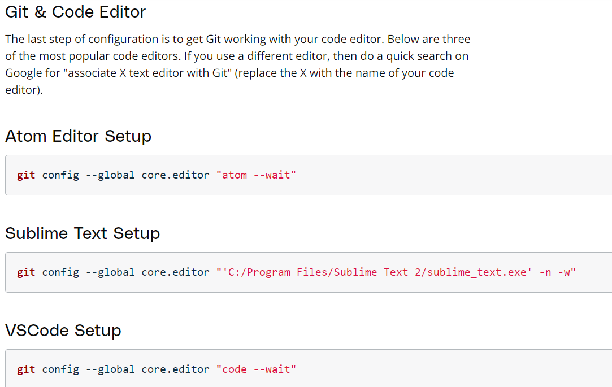

**Version Control With Git**

-   **a Version Control** System is just software that helps you control
    (or manage) the different versions\...of something (typically source
    code).

-   There are two different categories of **version Control systems**:
    **Centralized** model and **Distributed** model

-   **In A centralized model, there's one powerful central computer that
    hosts the project, every interaction must go through this central
    computer**

-   **In a distributed model, there's no central repository of
    information, each developer has a complete copy of the project on
    their computer**

-   **Git is a distributed version control system**

-   **Git is version control tool while Github is a service that hosts
    git projects**

-   **the main point of a version control system is to help you maintain
    a detailed history of the project as well as the ability to work on
    different versions of it. Having a detailed history of a project is
    important because it lets you see the progress of the project over
    time. If needed, you can also jump back to any point in the project
    to recover data or files.**

{width="7.42962489063867in"
height="4.803594706911636in"}

{width="5.813330052493439in"
height="3.6766491688538934in"}

**Create A Repo From Scratch**

To create a new repository with Git, we\'ll use the **git init**
command.

The **init** subcommand is short for \"initialize\", which is helpful
because it\'s the command that will do all of the initial setup of a
repository.

**Required Commands**

**ls** - used to list files and directories

**mkdir** - used to create a new directory

**cd** - used to change directories

**rm** - used to remove files and directories

**pwd** - which stands for "print working directory"

**Create Course Directories**

{width="6.808923884514436in"
height="1.5001301399825022in"}

**Git Init\'s Effect**

> Running the git init command sets up all of the necessary files and
> directories that Git will use to keep track of everything. All of
> these files are stored in a directory called .git (notice the . at the
> beginning - that means it\'ll be a hidden directory on Mac/Linux).
> This .git directory is the \"repo\"! This is where git records all of
> the commits and keeps track of everything!
>
> **WARNING**: Don\'t directly edit any files inside the .git directory.
> This is the heart of the repository. If you change file names and/or
> file content, git will probably lose track of the files that you\'re
> keeping in the repo, and you could lose a lot of work! It\'s okay to
> look at those files though, but don\'t edit or delete them.

**.Git Directory Contents**

Here\'s a brief synopsis on each of the items in the .git directory:

-   **config file** - where all project specific configuration settings
    are stored.

    -   Git looks for configuration values in the configuration file in
        the Git directory (.git/config) of whatever repository you're
        currently using. These values are specific to that single
        repository.

```{=html}
<!-- -->
```
-   **description file** - this file is only used by the GitWeb program,
    so we can ignore it

-   **hooks directory** - this is where we could place client-side or
    server-side scripts that we can use to hook into Git\'s different
    lifecycle events

-   **info directory** - contains the global excludes file

-   **objects directory** - this directory will store all of the commits
    we make

-   **refs directory** - this directory holds pointers to commits
    (basically the \"branches\" and \"tags\")

**Clone An Existing Repo**

**what is cloning?**

to make an identical copy

> You pass a path (usually a URL) of the Git repository you want to
> clone to the **git clone** command.
>
> **Git Clone Recap**
>
> The **git clone** command is used to create an identical copy of an
> existing repository.
>
> **\$ git clone \<path-to-repository-to-clone\>**
>
> This command:

-   takes the path to an existing repository

-   by default will create a directory with the same name as the
    repository that\'s being cloned

-   can be given a second argument that will be used as the name of the
    directory

-   will create the new repository inside of the current working
    directory

**Git Status**

> To figure out what\'s going on with a repository, we use the **git
> status** command. Knowing the status of a Git repository is extremely
> important
>
> The **git status** is our key to the mind of Git. It will tell us what
> Git is thinking and the state of our repository as Git sees it. When
> you\'re first starting out, you should be using the git status command
> all of the time! Seriously.
>
> You should get into the habit of running it after any other command.
> This will help you learn how Git works and it\'ll help you from making
> (possibly) incorrect assumptions about the state of your
> files/repository.
>
> \$ git status

{width="7.875in"
height="8.338194444444444in"}
